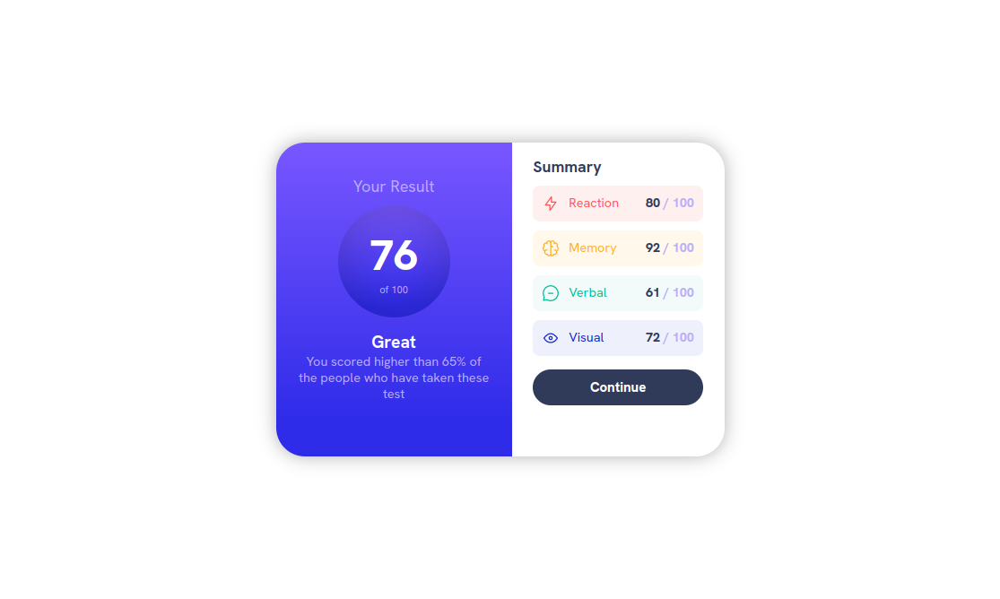

# Frontend Mentor - Results summary component solution

This is a solution to the [Results summary component challenge on Frontend Mentor](https://www.frontendmentor.io/challenges/results-summary-component-CE_K6s0maV). Frontend Mentor challenges help you improve your coding skills by building realistic projects.

## Table of contents

## Overview

### The challenge

Users should be able to:

- View the optimal layout for the interface depending on their device's screen size
- See hover and focus states for all interactive elements on the page

### Screenshot

### Links

- Solution URL: [Add solution URL here](https://your-solution-url.com)
- Live Site URL: [Add live site URL here](https://your-live-site-url.com)

## My process

### Built with

- Semantic HTML5 markup
- CSS custom properties
- Flexbox

**Note: These are just examples. Delete this note and replace the list above with your own choices**

### What I learned

I just learned that I need to learn things like box shadow and other css properties beacause even thought i know what they do there are some of them that i haven't even looked into it in details. for example the background linear gradient, i haven't checked all the values it takes and this project taught me to reflect on my basics

**Note: Delete this note and the content within this section and replace with your own learnings.**

### Continued development

css

### Useful resources

## Author

- Website - Marzuk Entsie
- Frontend Mentor - [@Zukizuk](https://www.frontendmentor.io/profile/Zukizuk)

## Acknowledgments
